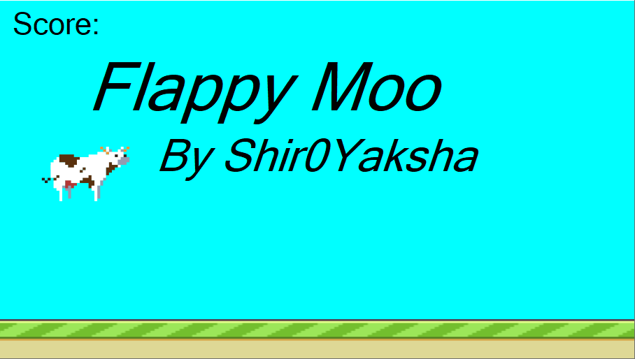
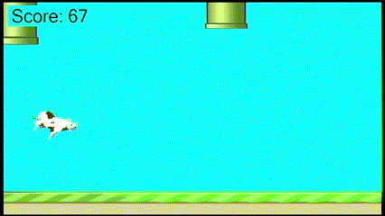

# Flappy Moo
A clone of flappy bird with a few changes made using WinForms

# How to play
To play the game, download the zip file from [releases](https://github.com/Sh1r0Yaksha/Flappy_Moo/releases/latest), make sure [.NET6 runtime](https://download.visualstudio.microsoft.com/download/pr/85473c45-8d91-48cb-ab41-86ec7abc1000/83cd0c82f0cde9a566bae4245ea5a65b/windowsdesktop-runtime-6.0.16-win-x64.exe) is installed, and run "Flappy_Moo.exe".

# Attributions
- Cow sprite from  <a href="https://www.freepik.com/free-vector/flat-design-pixel-art-character-collection_32390039.htm#query=pixel%20cow&position=1&from_view=keyword&track=ais">Freepik</a>
- Pipe and ground sprites from <a href="https://www.mooict.com/create-flappy-bird-game-in-visual-studio-using-c/">Moo ICT</a>
- Moo sound effect from <a href="https://www.fesliyanstudios.com/play-mp3/6518">Fesliyanstudios.com</a>
